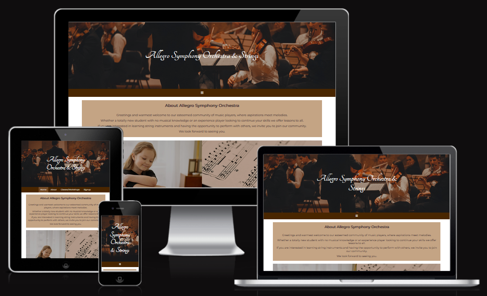
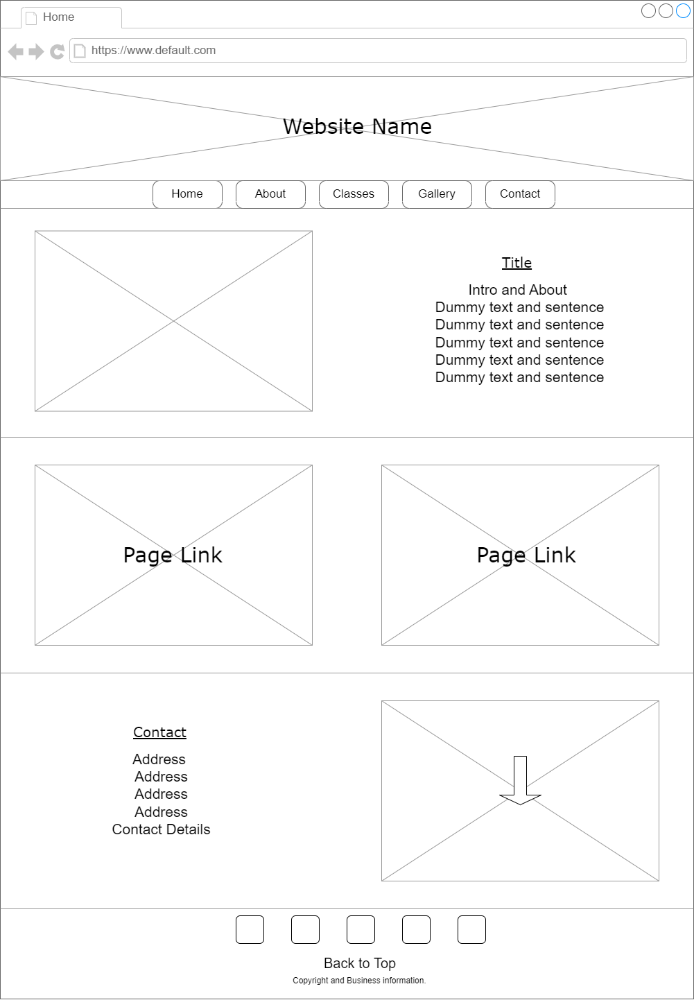
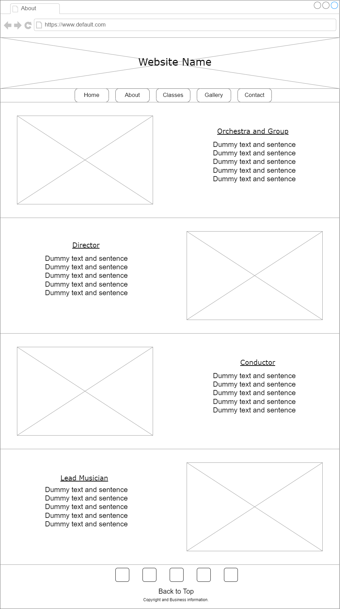
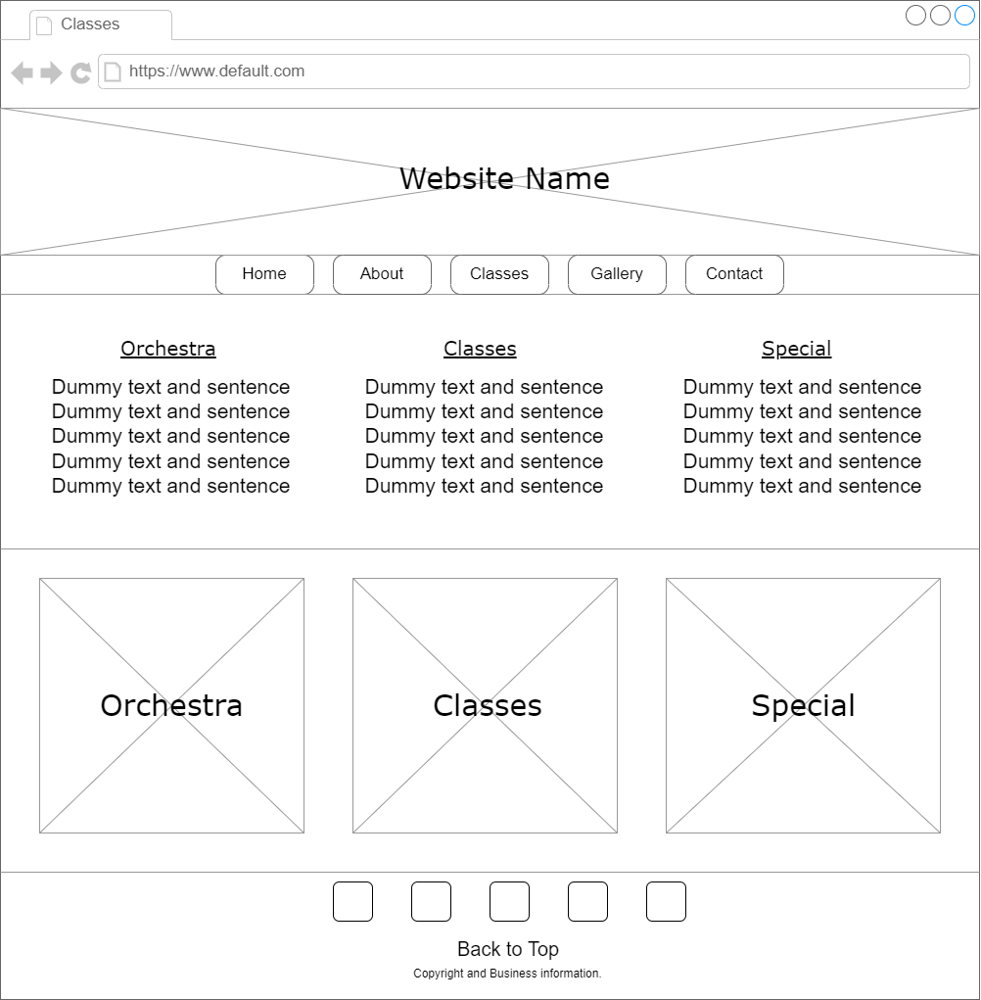
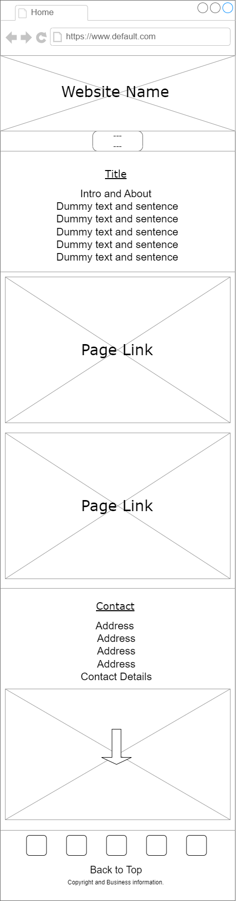
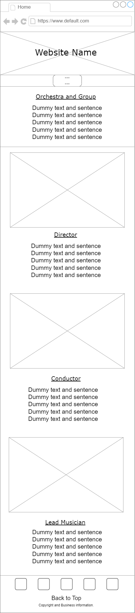
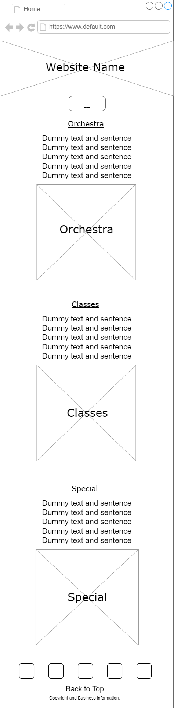
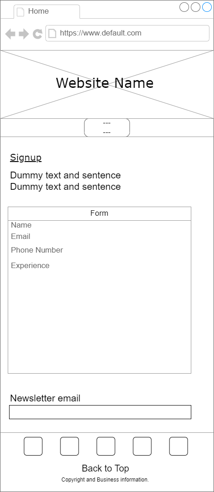

# Allegro Symphony Orchestra and Strings Group

## Code Institute - Milestone Project 1 

### HTML/CSS Essentials - Users Sentric, Static Front-End Website

View Repository in GitHub Pages: https://github.com/mparker-landt/Milestone_Project_1

View Website Link: https://mparker-landt.github.io/Milestone_Project_1/

Author: Marcus Parker
Github: mparker-landt

## The purpose for this project

To advertise a classical music orchestra and strings group in Bristol and Southwest area. 

Potential players can sign up for lessons and voluntarily participate in a regularly scheduled orchestra. 

# Table of Content

+ [UX](#ux "UX")
  + [User Demographic](user-demographic "User Demographic")
  + [User Stories](user-stories "User Stories")
  + [Design](#design "Design")
    + [Wireframes](#wireframes "Wireframes")
    + [Colour Scheme](#colour-scheme "Colour Scheme")
    + [Typography](#typography "Typography")
    + [Images](#design "Design")

+ [Features](#features "Features")
  + [Existing Features](#existing-features "Existing Features")
    + [Header and Navigation Bar](#header-and-navigation-bar "Header and Navigation Bar") 
    + [Footer](#footer "Features")
    + [Home Page](#home-page "Home Page")
    + [About Page](#about-page "About Page")
    + [Classes Page](#classes-page "Classes Page")
    + [Contact Page](#contact-page "Contact Page")
  + [Features To Add](#features-to-add "Features To Add")

+ [Resources](#resources "Resources")
  + [Technologies](#technologies "Technologies")
  + [External Resources](#external-resources "External Resources")

+ [Testing](#testing "Testing")
  + [HTML Validator Testing](#html-validator-testing "HTML Validator Testing")
  + [CSS Validator Testing](#css-validator-testing "CSS Validator Testing")
  + [Lighthouse Performance Testing](#lighthouse-performance-testing "Lighthouse Performance Testing")
 
+ [Deployment](#deployment "Deployment")

+ [Credits and Aknowledgements](#credits-and-aknowledgements "Credits and Aknowledgements")

## UX
### User Demographic
### User Stories
- ### User Stories

  - #### First time Users Goals:

  - As a new beginner I want to quickly find if services are provided for complete novices so I can start practicing music.

  - #### Returning Users Goals:

  - As an experienced musician I want to find easily when and where classes and workshops are so I can assess the logistics of travel and scheduling.

  - As an experienced musician I want to be able to quickly sign up to the orchestra and music services provided so I can start lessons and participate in group sessions as quick as possible

  - #### Frequent Users Goals:

  - As a 

### Testing User Stories from User Experience (UX) Section

 #### First Time Visitor Goals: 

  ###### As a First Time Visitor, I want to easily see the studio offers, find when the classes take place (timetable) also the prices and offers:
     

  ##### As a First Time Visitor, I want to be able to easily be able to navigate throughout the site to find content and find where the studio is located:

  ##### As a first time visitor I want to see some stories and reviews from other ussers to get to know the studio. I also want to find the links to the social media to find more information about the studio and users thoughts and reviews and be able to determine how trasted and known the studio is:

    
 #### Returning Visitor Goals: 

  ##### As a returning Visitor, I want to book easily classes and workshops:
   

  ##### As a returning Visitor, I want to find any new updates in the timetable and workshops section:

  ##### As a Returning Visitor, I want to find the best way to get in contact with the organisation with any questions I may have:

 #### Frequent Users Goals:

##### As a Frequent User, I want to be able to book a class easily:

##### As a Frequent User, I want to check to see if there are any new workshops.

##### As a Frequent User, I want to sign up to the Newsletter so that I am emailed any major updates and/or changes to the class timetable, website workshops or events.
### Design
#### Wireframes
Wireframes were created with draw.io
Basic structure for Laptop and larger screens:

Home Page

About Page

Classes Page

Contact Page

Basic structure for Mobile and smaller screens:

Home Page:

About Page

Classes Page

Contact Page

#### Colour Scheme
#### Typography
#### Images

## Features

Allegro Symphony Strings and Orchestra is a multi-page website consisting of the pages:
- Home Page
- About Page
- Classes and Workshop Page
- Contact Page

Every page has the same header with header image and title as well as a navigation bar and footer.

### Existing Features
#### Header and Navigation Bar
- The Header consists of a header image and header title. Clicking the header title navigates back to the homepage.
- The Navigation Bar highlights the active tab for easy visual of the current page.
- The Navigation Bar highlights a tab on hover for easy visual of what page it will be changed to.
- For small screens the Navigation Bar collapses into a burger icon which can be opened and closed with a click/touch.
- The Navigation Bar is located under the header image but sticks to the top of the page when scrolled past to make navigation easy.

#### Footer
- The Footer contains links to social media pages, easily viewed as recognised icons for a clean look.
- A "Back to Top" link is situated in the Footer for a quick way to navigate to the top of the page.
- The Footer consists copyright and business information, made small text to discreetly blend into the page whilst providing necessary information.

#### Home Page
- The Home Page consists of an About, Linkthrough and Find Us sections.
- The Linkthrough section is split into two images with titles as links that navigate to their respective pages.
- The Find Us section consists of an address and contact information as well as en embedded iframe for easily viewing the location on a map.

#### About Page
- The About Page consists of an overall Orchestra, VIP People and Partner Group sections.
- The Orchestra section shows the history and information of the Allegro Symphony Group since it's founding.
- The VIP people section consists of images and text information about people that make up the Allegro Symphony Group.
- The Partner Group section consists of boxes that provide information about other websites.
- Each Partner Group section box has a front face that shows a picture, on hover or tap this "flips" to provide a back face that has information and an ecternal link to the other group.

#### Classes Page
- The Classes Page consists of a Classes and a Schedule Section.
- The Classes section is split into thirds, each third providing information about the different classes or workshops.
- The Schedule section consists of boxes with times, scheduled days and locations of the different classes situated on a dimmed background to make the information easily viewed.

#### Contact Page
- The Contact Page consists of a Signup information, Signup Form, Contact details and newsletter sections.
- The Signup Form section has multiple inputs including text, telephone, calender and a selection box.
- The Singup Form section has a submit and reset button that links to the form.
- The Contact details section has text with the Allegro Groups contact details and address.
- The Newsletter section has an input for an email and a submit button. 

### Features To Add

## Resources
### Technologies
- [HTML](https://en.wikipedia.org/wiki/HTML5)
- [CSS](https://en.wikipedia.org/wiki/CSS)
### External Resources
- [Pexels](https://www.pexels.com/)
- [Font Awesome](https://fontawesome.com/)
- [Google Fonts](https://fonts.google.com/)
- [MyColor](https://mycolor.space/)

## Testing
### HTML Validator Testing
https://validator.w3.org/
### CSS Validator Testing
https://jigsaw.w3.org/css-validator/
### Lighthouse Performance Testing

## Deployment
This project was created with an environment consisting of the tools:
- VS Code
- Sourcetree
- Github & Git
- Firefox Web Browser
- Chrome Web Browser

The base for the project was created using the Code Institute template:
* https://github.com/Code-Institute-Org/ci-full-template

The project is deployed on Github.
* Link to the project:
https://github.com/mparker-landt/Milestone_Project_1
* Link to the live link:
https://mparker-landt.github.io/Milestone_Project_1/

## Credits and Aknowledgements

Thanks to:
* Lauren-Nicole Popich - Code Institue Mentor, provided lots of help and direction
* Manuel Perez Romero - College of Bristol Mentor
* Renske Hoste - Helped with design and layout tips

