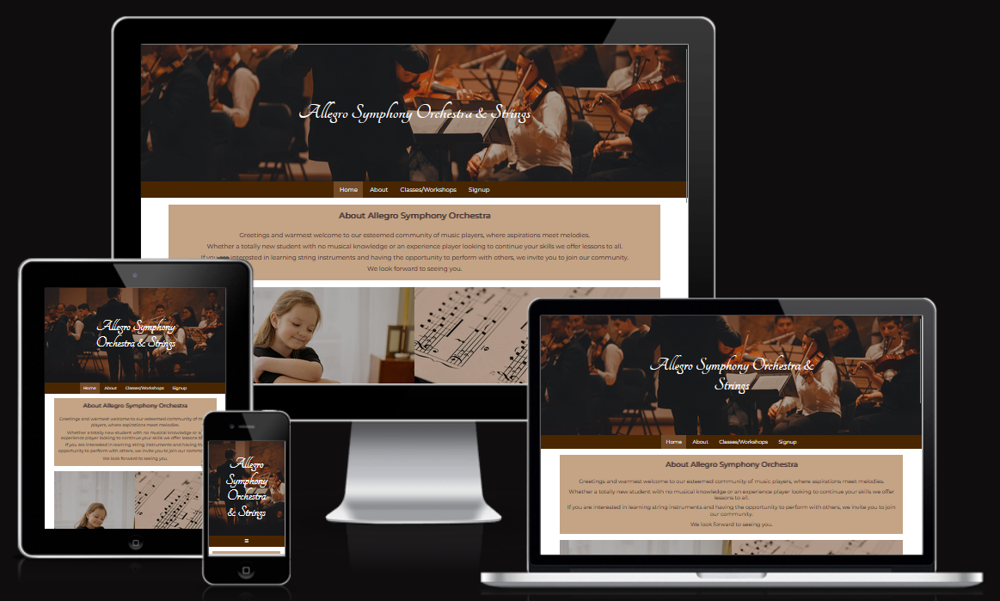
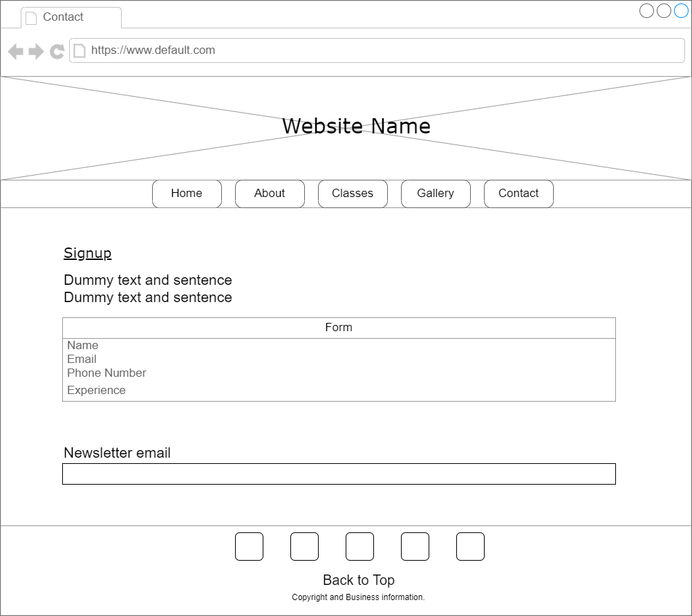

# Allegro Symphony Orchestra and Strings Group

## Code Institute - Milestone Project 1 

### HTML/CSS Essentials - Users Sentric, Static Front-End Website

View Repository in GitHub Pages: https://github.com/mparker-landt/Milestone_Project_1

View Website Link: https://mparker-landt.github.io/Milestone_Project_1/

Author: Marcus Parker\
Github: [mparker-landt](https://github.com/mparker-landt)

## The purpose for this project

The purpose of this static website was to provide a classical music orchestra and strings group in Bristol and the South West area of England.

The website is split into 4 pages, a Home Page, About Page, Classes Page and Contact Page.

The target audience would be string instrument musicians looking to join an orchestra. Particular focus is on attracting novice players that have an interest in learning string instruments.\
The services are also provided for younger musicians and juniors who want to learn / continue thier learning. 

Registration is done through a sign up form or by using the provided contact details. A newsletter can also be signed up to for news updates. 

## Table of Content
+ [UX](#ux "UX")
  + [User Demographic](user-demographic "User Demographic")
  + [User Stories](user-stories "User Stories")
    + [First time Users Stories](first-time-user-stories "First Time Users Stories")
    + [Returning Users Stories](#returning-user-stories "Returning Users Stories")
  + [User Goals](#user-goals "User Goals")
  + [Design](#design "Design")
    + [Wireframes](#wireframes "Wireframes")
    + [Colour Scheme](#colour-scheme "Colour Scheme")
    + [Typography](#typography "Typography")
    + [Images](#design "Design")
+ [Features](#features "Features")
  + [Existing Features](#existing-features "Existing Features")
    + [Header and Navigation Bar](#header-and-navigation-bar "Header and Navigation Bar") 
    + [Footer](#footer "Features")
    + [Home Page](#home-page "Home Page")
    + [About Page](#about-page "About Page")
    + [Classes Page](#classes-page "Classes Page")
    + [Contact Page](#contact-page "Contact Page")
+ [Resources](#resources "Resources")
  + [Technologies](#technologies "Technologies")
  + [External Resources](#external-resources "External Resources")
+ [Testing](#testing "Testing")
  + [HTML Validator Testing](#html-validator-testing "HTML Validator Testing")
  + [CSS Validator Testing](#css-validator-testing "CSS Validator Testing")
  + [Lighthouse Performance Testing](#lighthouse-performance-testing "Lighthouse Performance Testing")
+ [Deployment](#deployment "Deployment")
+ [Credits and Aknowledgements](#credits-and-aknowledgements "Credits and Aknowledgements")
  + [Other Credits](#other-credits "Other Credits")

## UX
### User Demographic
This website is targeted towards:
- People in the South West and Bristol areas of England who want to learn a stringed instrument.
- People in the South West and Bristol areas of England who want to join an orchestra.
- People in the South West and Bristol areas of England who want to join a string quartet.
- People in the South West and Bristol areas of England who have children that they want to learn to play a stringed instrument or participate in an orchestra.
### User Stories
#### First time Users Stories:
- As a new user I want to be able to see what services are provided for complete novices so I can start practicing music.
- As a new user I want to be able to see what services are provided for experienced musicians so I can continue practicing music.
- As a new user I want to be able to find out here the group is situated and what the contact details are.
- As a new user I want to be able to sign up to join the group.
#### Returning Users Stories:
- As a returning user I want to be able to quickly navigate to the social media links.
- As a returning user I want to be able to find out when and where are the services the group provides.
- As a returning user I want to be able to find out here the group is situated and what the contact details are.
- As a returning user I want to be able to sign up to join the group.
- As a returning user I want to be able to sign up for the regular newsletter.
### User Goals
- Find information on the music group.
- Find out when and where the services are provided.
- Sign up to the music group.
- Contact the music group.
- View the social media of the music group.

### Design
#### Wireframes
Wireframes were created with draw.io

Basic structure for Laptop and larger screens:\
Home Page\
\
About Page\
\
Classes Page\
\
Contact Page\
\

Basic structure for Mobile and smaller screens:\
Home Page\
\
About Page\
\
Classes Page\
\
Contact Page\

#### Colour Scheme
The colour scheme was generated using the site [ColorSpace](https://mycolor.space/).\
The base colour scheme generated:\
\
With minor adjustments to some colours for personal preference.
#### Typography
Fonts for the website came from [Google Fonts](https://fonts.google.com/).\
For the main body the general font Montserrat was used, a popular frontend font due to its readability and availability.\
For the Header title the stylised font Tangerine was used, this allowed for readability whilst given the impression of cursive writing for the classical impression.
#### Images
All images were aquired from [Pexels](https://www.pexels.com/), a site that provides free high quality stock photos for general use.\
Link to their license : https://www.pexels.com/license/

## Features
Allegro Symphony Strings and Orchestra is a multi-page website consisting of the pages:
- Home Page
- About Page
- Classes and Workshop Page
- Contact Page\
\
Every page has the same header with header image and title as well as a navigation bar and footer.

### Existing Features
#### Header and Navigation Bar
- The Header consists of a header image and header title. Clicking the header title navigates back to the homepage.
- The Navigation Bar highlights the active tab for easy visual of the current page.
- The Navigation Bar highlights a tab on hover for easy visual of what page it will be changed to.
- For small screens the Navigation Bar collapses into a burger icon which can be opened and closed with a click/touch.
- The Navigation Bar is located under the header image but sticks to the top of the page when scrolled past to make navigation easy.

#### Footer
- The Footer contains links to social media pages, easily viewed as recognised icons for a clean look.
- A "Back to Top" link is situated in the Footer for a quick way to navigate to the top of the page.
- The Footer consists copyright and business information, made small text to discreetly blend into the page whilst providing necessary information.

#### Home Page
- The Home Page consists of an About, Linkthrough and Find Us sections.
- The Linkthrough section is split into two images with titles as links that navigate to their respective pages.
- The Find Us section consists of an address and contact information as well as en embedded iframe for easily viewing the location on a map.

#### About Page
- The About Page consists of an overall Orchestra, VIP People and Partner Group sections.
- The Orchestra section shows the history and information of the Allegro Symphony Group since it's founding.
- The VIP people section consists of images and text information about people that make up the Allegro Symphony Group.
- The Partner Group section consists of boxes that provide information about other websites.
- Each Partner Group section box has a front face that shows a picture, on hover or tap this "flips" to provide a back face that has information and an ecternal link to the other group.

#### Classes Page
- The Classes Page consists of a Classes and a Schedule Section.
- The Classes section is split into thirds, each third providing information about the different classes or workshops.
- The Schedule section consists of boxes with times, scheduled days and locations of the different classes situated on a dimmed background to make the information easily viewed.

#### Contact Page
- The Contact Page consists of a Signup information, Signup Form, Contact details and newsletter sections.
- The Signup Form section has multiple inputs including text, telephone, calender and a selection box.
- The Singup Form section has a submit and reset button that links to the form.
- The Contact details section has text with the Allegro Groups contact details and address.
- The Newsletter section has an input for an email and a submit button. 

## Resources
### Technologies
- [HTML](https://en.wikipedia.org/wiki/HTML5)
- [CSS](https://en.wikipedia.org/wiki/CSS)
- [JS](https://en.wikipedia.org/wiki/JavaScript)
### External Resources
- [Pexels](https://www.pexels.com/)
- [Font Awesome](https://fontawesome.com/)
- [Google Fonts](https://fonts.google.com/)
- [MyColor](https://mycolor.space/)
- [W3 Schools](https://www.w3schools.com/)
- [Stack Overflow](https://stackoverflow.com/)
- [Draw.io](https://www.drawio.com/)

## Testing
Testing of the website was performed throughout it's development period.\
The local files were opened and used in a Firefox or Chrome Web browser to view the visual and functional bugs.\
Browser Developer Tools were used to debug the code and explore mobile screens.

### HTML Validator Testing
https://validator.w3.org/
### CSS Validator Testing
https://jigsaw.w3.org/css-validator/
### Lighthouse Performance Testing

## Deployment
This project was created with an environment consisting of the tools:
- VS Code - IDE to develop and view the code.
- Sourcetree to Pull, Reset, Commit and Push the code.
- Github & Git - Version and Source control to save the code and see the history. 
- Firefox Web Browser - Used to view and debug the code.
- Chrome Web Browser - Used to view and debug the code.

The base for the project was created using the Code Institute template:
* https://github.com/Code-Institute-Org/ci-full-template

The project is deployed on Github:
* Link to the project:
https://github.com/mparker-landt/Milestone_Project_1
* Link to the live link:
https://mparker-landt.github.io/Milestone_Project_1/

To aquire the code:
- Log into Github
- Navigate to the project link
- On the project page click the Code button
- Clone or download the zip of the code
- Open the poject in an environment of your choice\

\
All content on the website was produced by the author of the project and is fiction. \
All people and content are fictional and any details such as contact details and business information do not exist in real life.\
Any link to external sites will navigate to a real website but these are for navigation only and have no affliction with the fictional Allegro Symphony Orchestra. 

## Credits and Aknowledgements
With big thanks to my mentors:
* Lauren-Nicole Popich from the Code Institute who provided a massive amount of help with the assignment and code review.
* Manuel Perez Romero, my mentor from the Bristol of City College who provide help and examples for the project.

And with additional aknowledgement to:
* Renske Hoste, a friend who helped with design and layout tips
### Other Credits
Particular mention to W3Schools  and the StackOverflow Community that provided a lot of help with the coding.\
In particular these pages were used for specific parts of the website:\
https://www.w3schools.com/howto/howto_css_flip_box.asp\
https://www.w3schools.com/howto/howto_js_topnav_responsive.asp

